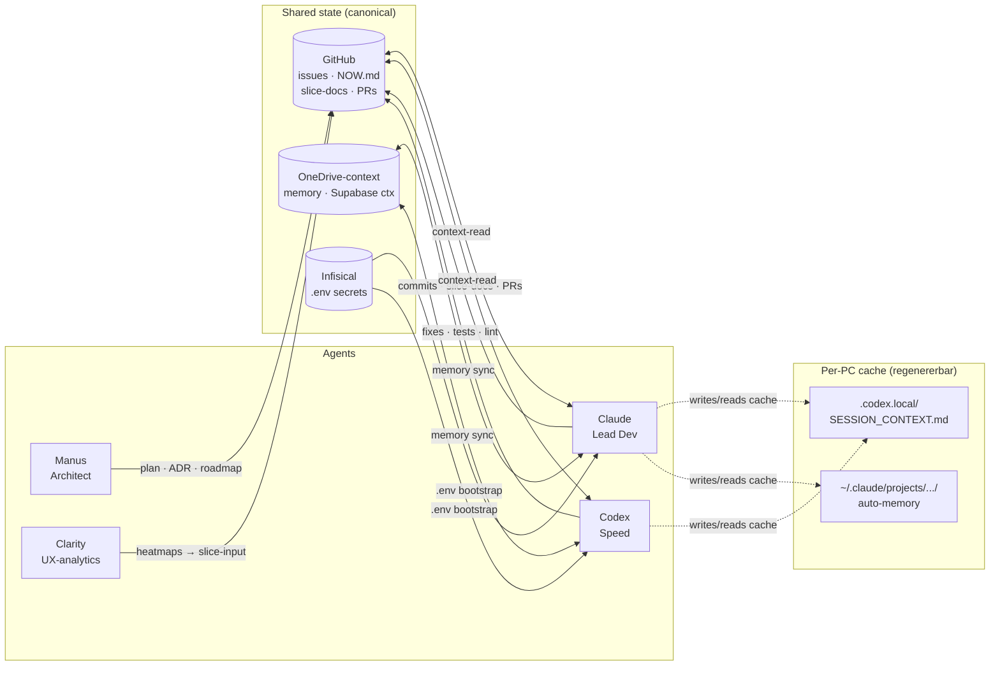

# Agent-arkitektur

> **On-demand doc.** Auto-loader IKKE. Læs ved: cross-agent bug, ny PC/agent onboarding, parallel-session-setup, failure-mode lookup.
>
> **Politik/discipline →** [`AGENTS.md`](../AGENTS.md). **Visuel topologi + failure-modes →** denne fil.

## TL;DR

- 3 agents: **Claude** (Lead Dev) · **Codex** (Speed) · **Manus** (Architect). Plus **Clarity** (UX-analytics, ikke AI).
- 3 shared-state systemer: **GitHub** (issues + repo-docs, canonical) · **OneDrive-context** (memory hardlinks) · **Infisical** (secrets).
- Lokale agent-filer (`.codex.local/`, auto-memory) er **caches**, ikke source of truth.
- Parallel-sessions samme PC: brug `git worktree` + ét issue per session + skriv NOW.md kun ved close-out.

## Diagram



## Ejerskab (agent × work-type)

| Work type | Owner | Hvorfor |
|---|---|---|
| Multi-file refactor m. kontrakt-implikationer | Claude | Slice-docs + AskUserQuestion |
| Single-file bugfix m. klar root cause | Codex | Speed |
| Ny feature, uklar spec | Claude | Q&A-session |
| Migration >2 tabeller | Claude | Kontrakt-sikkerhed |
| Lint/format/typo | Codex | Speed |
| Audit på tværs af repo | Claude (m. Explore-subagents) | Token-budget |
| Strategi · roadmap · ADR | Manus | Cross-domain |
| Loop-implementering | Claude (kompleks) / Codex (simpel) | Spec i [`AI_LOOPS.md`](./AI_LOOPS.md) |
| UX-data → slice | Clarity → Claude/Codex | [Loop I](./AI_LOOPS.md) |

Fuldt regelsæt: [`AI_OPS_REFERENCE.md §Rolle-fordeling`](./AI_OPS_REFERENCE.md#rolle-fordeling-mellem-ai-assistenter-verdensklasse-ai-standard) (udfaset fra AGENTS.md 2026-05-29, [#733](https://github.com/NicolaiDolmer/CyclingZone/issues/733)).

## Parallel-session-safety (samme PC, flere Claude-sessions samtidigt)

Du kan have 2+ Claude Code-sessions åbne på samme PC. Følgende ressourcer kolliderer — fix'es med worktrees + disciplin.

### Kollisions-matrix

| Resource | Collision-mode | Mitigation |
|---|---|---|
| `git` working tree | Begge sessions checker forskellige branches → sidste vinder | **Worktree per session:** `git worktree add ../cz-<slug> -b <branch>` (eller `.claude/worktrees/<slug>/`) |
| `docs/NOW.md` | Begge skriver "Senest leveret" → merge-konflikt | **Skriv KUN ved close-out**, ikke undervejs. Brug `gh issue comment` til in-progress status |
| `MEMORY.md` (auto-memory) | Begge sessions appender pointers | Per-session auto-memory mappe i Claude Code default. Drift-protokol: [`AGENTS.md §8`](../AGENTS.md#hard-rules-gælder-alle-aier--claude-codex-fremtidige) |
| `.codex.local/SESSION_CONTEXT.md` | Single active-issue cache; én session overskriver anden | Regenererbar — slet ved tvivl. Sandhed = `gh issue view N` |
| `PatchNotesPage.jsx` version | Begge bumper v3.X → merge-konflikt | Bump til `max(main, lokal) + 1` lige før commit ([memory: feedback_patch_notes.md](file:///../memory/feedback_patch_notes.md)) |
| Vercel-deploy queue | Hver `git push` deployer → queue/race | Accept — Vercel queue'r. Kør `verify-deploy.ps1` efter sidste push |
| GitHub issue ownership | Begge sessions claim samme `claude:todo` | **Én session = ét issue.** Kommenter `Claude working on this` ELLER skift label → `claude:in-progress` ved start |
| MCP-servers (Supabase, Discord, Vercel) | Stateful long-running connections | Hold MCP-kald stateless/ad-hoc. Undgå parallelle MCP-tråde mod samme target |
| Branch-konflikt på push | Session 2 pusher; session 1's push fejler `non-fast-forward` | `git pull --rebase` inden push. Worktrees gør dette automatisk pr. branch |

### Recipe — start session 2 sikkert

```pwsh
# I session 1's terminal — bekræft state
git status -sb                              # noter aktiv branch
git rev-parse HEAD                          # noter SHA

# I session 2's terminal — opret isoleret worktree
git fetch --prune origin
git worktree add ../cz-<slug> -b <type>/<issue>-<slug> origin/main
cd ../cz-<slug>
# Session 2 arbejder her — ingen overlap med session 1
```

### Hvad der IKKE kolliderer

- Issue-kommentarer (`gh issue comment N`) — append-only, GitHub serialiserer
- Worktrees på forskellige branches — fuld isolation af working tree
- Lokale builds (`npm run build`) — egen working dir per worktree
- Skills · agent-tool · MCP-server-defs — read-only fra session-perspektiv

### Cleanup efter session

```pwsh
git worktree remove ../cz-<slug>            # eller .claude/worktrees/<slug>/
git branch -D <branch>                      # hvis merged via PR
```

SessionStart-hook cleaner `.claude/worktrees/` automatisk efter ship (per [AGENTS.md §Worktree-disciplin](../AGENTS.md#worktree-disciplin-claude-specifikt)).

## Handoff-protokoller

| Fra → Til | Hvor | Format |
|---|---|---|
| Manus → Claude | GitHub issue + slice-doc | Issue-body m. spec; slice-doc m. kontrakt + verification-path |
| Claude → Codex | Issue-kommentar m. commit-SHA + slice-doc | "Done: <list>". Codex tager test/lint follow-ups. (`claude:done` label er valgfri — bruger kan også lukke direkte fra todo/in-progress.) |
| Codex → Claude | PR-kommentar + issue-comment | Test-resultater + edge-cases fundet |
| Session A → Session B (samme agent, samme PC) | `docs/NOW.md` ved close-out + issue-comment | 15-linjers `Session context — [dato]` ([AGENTS.md §Delt handoff-format](../AGENTS.md#delt-handoff-format-alle-agents)) |
| PC1 → PC2 (samme agent) | GitHub + OneDrive-context | Identisk m. session A→B. Lokale caches regenereres på modtagende PC |
| Clarity → Claude/Codex | Ugentlig review-doc → ny slice | [Loop I](./AI_LOOPS.md) |

**Natbølger (multiagent-fleet om natten):** protokol (preflight GO/NO-GO, launch-bevis, merge-rækkefølge) + recovery i [`NIGHT_WAVE_RUNBOOK.md`](./NIGHT_WAVE_RUNBOOK.md) — læs FØR enhver natbølge claims.

## Failure-mode katalog

Auto-genereret fra `.claude/learnings/*.md`. **Regenerér med** `pwsh -File scripts/regenerate-agent-architecture.ps1`.

<!-- BEGIN FAILURE-MODES (auto-generated) -->

| Dato | Læring (klik for postmortem) |
|---|---|
| 2026-05-15 | [Postmortem · 2026-05-15 · Response-cache key collision and in-flight invalidation](../.claude/learnings/2026-05-15-response-cache-key-and-invalidation.md) |
| 2026-05-15 | [SessionStart-hook brugte pwsh-syntax i bash-eksekveret pipe](../.claude/learnings/2026-05-15-claude-settings-hook-bash-pwsh-pipe.md) |
| 2026-05-15 | [cross-pc-forensic-audit detekterede ikke hardlinks i pwsh 7](../.claude/learnings/2026-05-15-cross-pc-audit-pwsh-hardlink-bug.md) |
| 2026-05-15 | [Migration-drift: `schema.sql` kan dublere `database/*.sql` migration-applikation](../.claude/learnings/2026-05-15-migration-schema-drift.md) |
| 2026-05-15 | [local-only agent context drift](../.claude/learnings/2026-05-15-local-only-agent-context.md) |
| 2026-05-15 | [Discord MCP server-opsætning — findings 2026-05-15](../.claude/learnings/2026-05-15-discord-mcp-setup.md) |
| 2026-05-14 | [Lærepenge: Manus audit-rapport reviewet 2026-05-14](../.claude/learnings/2026-05-14-manus-audit-feedback.md) |
| 2026-05-13 | [Postmortem · 2026-05-13 · Quality net reported the wrong root cause](../.claude/learnings/2026-05-13-zero-known-error-hardening.md) |
| 2026-05-13 | [UCI sync schedule + Supabase WebSocket runtime](../.claude/learnings/2026-05-13-uci-sync-schedule-and-websocket.md) |
| 2026-05-13 | [Postmortem: Detector E flagged milestone-gated board event (#335)](../.claude/learnings/2026-05-13-detector-e-milestone-gated-event.md) |
| 2026-05-12 | [Bug](../.claude/learnings/2026-05-12-claude-action-max-turns-large-refactor.md) |
| 2026-05-11 | [Postmortem: Supabase service_role-nøgle rotation (#296)](../.claude/learnings/2026-05-11-supabase-key-rotation.md) |
| 2026-05-11 | [Signup economy placeholder](../.claude/learnings/2026-05-11-signup-economy-placeholder.md) |
| 2026-05-11 | [Multer upload security (#295)](../.claude/learnings/2026-05-11-multer-upload-security.md) |
| 2026-05-11 | [Postmortem: Password-reset brudt af Vercel SSO på preview-aliaser (#35)](../.claude/learnings/2026-05-11-auth-reset-vercel-sso.md) |
| 2026-05-10 | [2026-05-10 · Silent UPDATE-fail pga. ulovlig CHECK-værdi (#270 follow-up)](../.claude/learnings/2026-05-10-silent-update-due-to-check-violation.md) |
| 2026-05-10 | [Slice 14 "Udvikling"-fane viste tom-state i 14 dage pga. manglende RLS-policy](../.claude/learnings/2026-05-10-slice14-rls-policy-missing.md) |
| 2026-05-10 | [Backwards-audit der finder "deployed kode + 0 data / 0 brugere"](../.claude/learnings/2026-05-10-feature-liveness-backwards-audit.md) |
| 2026-05-10 | [2026-05-10 · Race-vindue mellem expiry-tjek og bid-INSERT (#269)](../.claude/learnings/2026-05-10-bid-after-expiry-race-window.md) |
| 2026-05-09 | [2026-05-09 · BEFORE INSERT-trigger som safety-net for "glemte" payload-felter](../.claude/learnings/2026-05-09-trigger-as-safety-net.md) |
| 2026-05-09 | [Postmortem: lejeaftale kunne annulleres ensidigt (#156)](../.claude/learnings/2026-05-09-loan-cancel-contract-integrity.md) |
| 2026-05-09 | [2026-05-09 · Dokumentér tilstand i DB — undgå kode-workarounds](../.claude/learnings/2026-05-09-document-state-not-workaround.md) |
| 2026-05-09 | [CREATE POLICY mangler IF NOT EXISTS](../.claude/learnings/2026-05-09-create-policy-no-if-not-exists.md) |
| 2026-05-08 | [Reserved-balance ignorerede proxy-forpligtelse (#193)](../.claude/learnings/2026-05-08-reserved-balance-proxy-blind-spot.md) |
| 2026-05-08 | [Postmortem: proxy-bidding stale winner-proxy edge case (#171)](../.claude/learnings/2026-05-08-proxy-bidding-stale-winner-proxy.md) |
| 2026-05-08 | [Postmortem: Discord-webhook for autobud sender ingen besked (#155)](../.claude/learnings/2026-05-08-discord-webhook-autobud.md) |
| 2026-05-08 | [Autobud skal også være et bud](../.claude/learnings/2026-05-08-autobud-opening-bid.md) |
| 2026-05-08 | [Auto-merge label-flow: deploy-verify fyrede ikke pga GITHUB_TOKEN anti-loop-safeguard](../.claude/learnings/2026-05-08-auto-merge-github-token-anti-loop.md) |
| 2026-05-08 | [Auktions-safety-pakke bundling (#192)](../.claude/learnings/2026-05-08-auction-safety-bundled-fixes.md) |
| 2026-05-07 | [Slice 07b: TOCTOU + idempotency-keys på cron-payouts](../.claude/learnings/2026-05-07-slice-07b-toctou-idempotency.md) |
| 2026-05-07 | [Ship-flow-friction (PR #152 + #153)](../.claude/learnings/2026-05-07-ship-flow-friction.md) |
| 2026-05-07 | [Automation-workflow-hardening efter natlig fail-audit](../.claude/learnings/2026-05-07-automation-workflow-hardening.md) |
| 2026-05-07 | [Auktionsvinduer beregnet 2 timer forkert (UTC vs CEST)](../.claude/learnings/2026-05-07-auction-timezone-utc-vs-cet.md) |
| 2026-05-05 | [Ønskeliste-auktionsnotifikation linkede til Transfers](../.claude/learnings/2026-05-05-watchlist-auction-notification-link.md) |

<!-- END FAILURE-MODES -->

## Regenerér

```pwsh
pwsh -File scripts/regenerate-agent-architecture.ps1            # opdatér failure-mode-tabel
pwsh -File scripts/regenerate-agent-architecture.ps1 -Check     # CI-mode: exit 1 hvis tabel out-of-sync
```

Scriptet er idempotent: no-op hvis intet er ændret. Bør køres efter hver ny `.claude/learnings/*.md` (postmortem [Loop C](./AI_LOOPS.md)).

---

_Doc-pattern: skema/tabel, ikke prosa (modstår rot). Referenceret fra `CLAUDE.md`, `AGENTS.md`, `docs/META_DOCS_INDEX.md`. Oprettet via [#387](https://github.com/NicolaiDolmer/CyclingZone/issues/387)._
