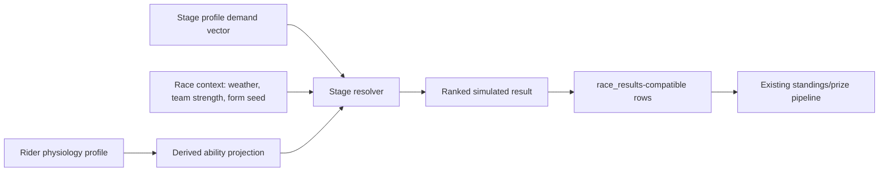

# ADR: Race Engine Architecture V1

**Status:** Accepted for implementation handoff
**Date:** 2026-06-04
**Owner:** Manus research / Claude Code implementation handoff
**GitHub:** [#675](https://github.com/NicolaiDolmer/CyclingZone/issues/675), related [#676](https://github.com/NicolaiDolmer/CyclingZone/issues/676), [#680](https://github.com/NicolaiDolmer/CyclingZone/issues/680), [#681](https://github.com/NicolaiDolmer/CyclingZone/issues/681), [#473](https://github.com/NicolaiDolmer/CyclingZone/issues/473)

## Decision

CyclingZone will introduce a **physiology-first race engine** where each rider has a compact physiological profile, each race stage has a structured demand profile, and the simulator resolves results by matching rider capacity against stage demands with seeded stochastic variance. The V1 engine must not be a disposable MVP. It should be intentionally small enough to ship before the TdF launch deadline, but its data model and scoring pipeline must be stable foundations for later tactics, form, training, equipment and live race detail.

The canonical V1 model is a **hybrid ability system**. It stores real cycling metrics such as FTP W/kg, VO2max proxy, peak power, high-intensity energy and fatigue resistance, then derives traditional game-facing abilities such as climbing, sprinting, time trial, punch and cobbles from those metrics. This gives advanced users a Strava/Zwift/WKO-style view while preserving the casual readability of classic cycling management games.

> The engine should answer one central question: **given this rider’s power-duration profile, body mass, durability and tactical skills, how well does that profile fit this stage’s physiological and tactical demand vector?**

## Context

CyclingZone currently stores PCM-like rider attributes in the `riders` table, synchronized through `backend/lib/dynCyclistSync.js`. Runtime verification shows that the current contract includes 14 legacy 0–99 fields such as `stat_bj`, `stat_tt`, `stat_sp`, `stat_acc`, `stat_res`, `stat_ftr`, `stat_fl`, `stat_bro` and `stat_mod`. The current canonical finalized-results pipeline is `backend/lib/raceResultsEngine.js`, which writes result rows compatible with `race_results` using fields such as `race_id`, `rider_id`, `team_id`, `result_type`, `rank`, `stage_number`, `finish_time`, `points_earned` and `prize_money`. The V1 race engine must therefore add a new simulation input layer without breaking the existing result persistence and standings logic.

The research brief in #675 asks for a world-class architecture across physiological rider modeling, stage-effort matching, reference analysis from cycling software and games, and a database/pseudocode handoff ready for implementation in #676. The related visual work in #473 is explicitly only a preview/mockup; this ADR defines the backend and product contract that will make those ideas real.

## Research summary

Modern cycling training and analysis converges on **power-duration profiling** rather than a single undifferentiated “skill” score. Critical Power research models performance as a relationship between sustainable power and finite work capacity above threshold. Critical Power is associated with the maximal aerobic steady state, while W′ models finite work above that threshold and its reconstitution after lower-intensity work.[^chorley-2020] Power profiling literature recommends multiple field-test durations and warns against reducing rider capacity to a single FTP estimate; the two-parameter relationship can be expressed as `P(t) = W′ / t + CP`.[^leo-2021]

Training software and coaching frameworks support the same direction. WKO describes a power-duration model with metrics such as Pmax, functional reserve capacity, modeled VO2max, modeled FTP, time to exhaustion and stamina.[^wko5] Xert uses a three-part “fitness signature” of **Peak Power**, **High Intensity Energy** and **Threshold Power**, then estimates real-time maximal power available from work above threshold and recovery below threshold.[^xert-mpa] TrainerRoad’s power-curve guidance separates sprint power, VO2max/punch and sustained power phenotypes, while its zone model maps effort bands to FTP percentages from recovery through anaerobic capacity.[^trainerroad-curve][^trainerroad-zones]

Professional race-demand literature also argues for a multivariable stage model. Stage type significantly affects race intensity, load and power profile: higher elevation gain tends to demand higher load and longer-duration power outputs, while flat and semimountain stages emphasize higher maximal mean power over shorter durations.[^sanders-2020] Fatigue resistance must be a first-class input because professional cyclists’ mean maximal power declines measurably with accumulated work; after 45 kJ/kg, the cited study observed declines around 6.0–9.7%, and WorldTour riders maintained power under fatigue better than ProTeam riders, especially for efforts of five minutes or longer.[^mateo-2022]

Game references support a hybrid model instead of pure physiology. Pro Cycling Manager keeps familiar race roles and tactics such as leader, team member, sprinter, breakaway, protection, wind, attack, counterattack, sprint train and mountain train; it is useful as UX inspiration but not as a transparent formula source.[^pcm-guide] Flamme Rouge demonstrates that cycling-game depth can emerge from a simple aerodynamic shelter/exhaustion mechanic: riders who lead work harder and receive exhaustion penalties.[^flamme-rouge] Football Manager’s long-term strength is a readable attribute model with hidden trade-offs and role matching. CyclingZone should adopt that readability while making its cycling physics more explicit and inspectable than PCM.

## Alternatives considered

| Alternative | Benefits | Rejection reason |
| --- | --- | --- |
| **Keep PCM-like 0–99 attributes only** | Fastest implementation and compatible with current UI. | It cannot support watt-based transparency, training-zone UX, physiology-driven balancing or credible future simulation depth. |
| **Store only raw physiology and remove traditional abilities** | Scientifically clean and transparent for expert users. | Too opaque for casual users; it would make rider comparison worse and break the current mental model in RiderStatsPage. |
| **Full second-by-second physics simulation in V1** | Best long-term realism, supports tactical race visualization. | Too large for the TdF deadline and unnecessary for current output, which only needs final results and standings. |
| **Monte Carlo-only black-box simulation** | Easy to tune distributions and produce plausible tables. | Hard to debug, hard to explain to users, and risks becoming another hidden lookup table. |
| **Hybrid physiology core plus derived abilities** | Transparent, extensible, readable, and compatible with existing result contracts. | Chosen. |

## Architecture overview

The V1 engine should be implemented as a deterministic seeded simulation pipeline. It does not need to animate a full race. Instead, it transforms rider physiology and stage demand into ranked finishing results and writes them through the existing result pipeline.



The most important implementation boundary is that the simulator should emit the **current result contract**, not invent a competing standings model. The new domain objects can be richer, but the public persistence path remains `race_results` until a later ADR changes standings architecture.

## Database schema proposal

The schema should separate **stored source metrics**, **derived game abilities**, and **stage demand profiles**. This avoids mixing user-facing ability labels with physiological inputs and lets future migrations regenerate derived abilities if balancing changes.

### `rider_physiology_profiles`

This table stores the canonical physiology source of truth for the race engine. Values can be initially seeded from current legacy stats, weight and height, then later updated by training, scouting or imports.

| Column | Type | Required | Notes |
| --- | --- | --- | --- |
| `id` | uuid | yes | Primary key. |
| `rider_id` | uuid / bigint matching `riders.id` | yes | Unique foreign key to `riders`. Use the existing project ID type. |
| `ftp_wkg` | numeric(4,2) | yes | Functional threshold power in W/kg. Initial elite game range: 3.00–6.80. |
| `ftp_watts` | integer | yes | Absolute FTP, derived from `ftp_wkg * weight_kg`, but stored for query/debug stability. |
| `vo2max_power_wkg` | numeric(4,2) | yes | Approximate 3–5 minute power capacity in W/kg. |
| `zone2_power_wkg` | numeric(4,2) | yes | LT1/aerobic endurance proxy, typically around 0.60–0.75 of FTP. |
| `pmax_watts` | integer | yes | Neuromuscular peak, roughly 1-second maximum. |
| `power_5s_wkg` | numeric(4,2) | yes | Sprint launch capacity. |
| `power_15s_wkg` | numeric(4,2) | yes | Sprint sustain capacity. |
| `power_1m_wkg` | numeric(4,2) | yes | Anaerobic/punch capacity. |
| `power_5m_wkg` | numeric(4,2) | yes | VO2max/puncheur and short-climb capacity. |
| `high_intensity_energy_kj` | numeric(5,1) | yes | W′/HIE/FRC-style finite work above threshold. |
| `time_to_exhaustion_ftp_min` | integer | yes | TTE at FTP, useful for TT and long climbs. |
| `fatigue_resistance` | numeric(4,3) | yes | 0.000–1.000 durability factor; lowers decline after accumulated work. |
| `recovery_rate` | numeric(4,3) | yes | 0.000–1.000 between-effort reconstitution proxy. |
| `height_cm` | numeric(5,2) | yes | Snapshot from rider profile for aero/body calculations. |
| `weight_kg` | numeric(5,2) | yes | Snapshot from rider profile; critical for relative and absolute power. |
| `source` | text | yes | `seeded_from_legacy`, `manual_admin`, `import`, `training_update`. |
| `version` | integer | yes | Starts at 1. Increment if formulas or source assumptions change. |
| `created_at` / `updated_at` | timestamptz | yes | Audit fields. |

### `rider_derived_abilities`

This table stores generated 0–99 abilities for fast UI queries and casual readability. It should be fully reproducible from `rider_physiology_profiles`, physical rider data and formula version.

| Column | Type | Notes |
| --- | --- | --- |
| `rider_id` | uuid / bigint | Unique foreign key to `riders`. |
| `formula_version` | integer | Allows rebalance without ambiguity. |
| `climbing` | smallint | W/kg FTP, 5m W/kg, fatigue resistance, low body mass. |
| `time_trial` | smallint | absolute FTP, FTP W/kg, TTE, aero/body proxy, positioning. |
| `sprint` | smallint | pmax, 5s, 15s, acceleration, positioning. |
| `punch` | smallint | 1m, 5m, HIE, recovery. |
| `endurance` | smallint | zone2, TTE, fatigue resistance. |
| `cobble_classics` | smallint | absolute power, weight/stability, handling, fatigue resistance. |
| `acceleration` | smallint | pmax and 5s shape. |
| `recovery` | smallint | recovery_rate plus fatigue resistance. |
| `tactics` | smallint | Initially seeded from legacy mental/team attributes or neutral baseline. |
| `positioning` | smallint | Sprint train, crosswind and crash-risk proxy. |
| `generated_at` | timestamptz | Audit field. |

The existing legacy fields on `riders` can remain during transition. V1 can either read from `rider_derived_abilities` directly or mirror the derived values into existing `stat_*` fields only if required by current UI. The recommended implementation is **read-new, fallback-old**: update API serializers to expose both `physiology` and `abilities`, then keep legacy fields as compatibility fallback.

### `race_stage_profiles`

This table describes the demand vector for a one-day race or a stage in a stage race. It can initially be admin-generated from distance, race category and route type, then later enriched with climb segments, weather and route imports.

| Column | Type | Required | Notes |
| --- | --- | --- | --- |
| `id` | uuid | yes | Primary key. |
| `race_id` | existing race ID type | yes | Foreign key to race. |
| `stage_number` | integer | nullable | Null for one-day races. |
| `profile_type` | text | yes | `flat`, `rolling`, `hilly`, `mountain`, `high_mountain`, `itt`, `ttt`, `cobbles`, `classic`. |
| `distance_km` | numeric(6,2) | yes | Stage length. |
| `elevation_gain_m` | integer | yes | Total ascent. |
| `summit_finish` | boolean | yes | Drives long-climb and explosive finish weighting. |
| `finale_type` | text | yes | `bunch_sprint`, `reduced_sprint`, `punch`, `long_climb`, `descent`, `solo_tt`, `breakaway`. |
| `max_gradient_pct` | numeric(4,1) | nullable | Optional route intensity. |
| `avg_key_climb_gradient_pct` | numeric(4,1) | nullable | Optional route intensity. |
| `cobbles_km` | numeric(5,2) | yes | Zero by default. |
| `gravel_km` | numeric(5,2) | yes | Zero by default. |
| `technicality` | numeric(4,3) | yes | 0–1 handling/positioning demand. |
| `crosswind_risk` | numeric(4,3) | yes | 0–1 positioning/team protection demand. |
| `weather_heat` | numeric(4,3) | yes | 0–1 heat stress. |
| `weather_rain` | numeric(4,3) | yes | 0–1 crash/handling stress. |
| `altitude_factor` | numeric(4,3) | yes | 0–1 sustained aerobic penalty. |
| `tactical_volatility` | numeric(4,3) | yes | 0–1 chance that attacks/breaks reshape ranking. |
| `demand_vector` | jsonb | yes | Normalized weights for scoring dimensions. |
| `version` | integer | yes | Starts at 1. |

A typical `demand_vector` should be explicit and normalized enough for tests. For example, a high mountain summit finish might weight `climbing_sustained: 0.35`, `fatigue_resistance: 0.20`, `vo2max: 0.15`, `punch: 0.10`, `team_support: 0.10`, `positioning: 0.05`, `randomness: 0.05`. A flat sprint might weight `sprint_15s: 0.28`, `pmax: 0.20`, `positioning: 0.18`, `team_leadout: 0.16`, `fatigue_resistance: 0.08`, `crosswind: 0.05`, `randomness: 0.05`.

### Optional V1 support tables

| Table | Purpose | V1 requirement |
| --- | --- | --- |
| `race_simulation_runs` | Stores seed, engine version, input checksum and run metadata. | Recommended for reproducibility. |
| `race_simulation_rider_scores` | Debug table with per-rider component scores for one run. | Recommended behind admin/debug flag. |
| `race_stage_segments` | Stores climbs, sprints and decisive sectors. | Optional; stage-level vector is enough for V1. |
| `rider_form_snapshots` | Daily form, freshness and morale. | Optional in V1; can begin as seeded race-day variance. |

## Ability derivation model

Derived abilities should be deterministic, monotonic and testable. The formulas should use percentile scaling within the current rider pool rather than hardcoded global assumptions where possible. This preserves balance if the database contains youth riders, fictional riders or generated long-tail riders.

| Ability | Physiological basis | Formula sketch |
| --- | --- | --- |
| **Climbing** | Relative sustained power and durability. | `scale(0.55*ftp_wkg + 0.20*power_5m_wkg + 0.15*fatigue_resistance - 0.10*weight_penalty)` |
| **Time trial** | Sustained absolute power, aero proxy and TTE. | `scale(0.35*ftp_watts + 0.25*ftp_wkg + 0.20*TTE + 0.10*positioning + 0.10*aero_proxy)` |
| **Sprint** | Peak and short-duration power. | `scale(0.35*pmax_watts + 0.25*power_5s_wkg + 0.20*power_15s_wkg + 0.10*positioning + 0.10*recovery)` |
| **Punch** | 1–5 minute repeatability. | `scale(0.35*power_1m_wkg + 0.25*power_5m_wkg + 0.20*HIE + 0.20*recovery_rate)` |
| **Endurance** | Zone 2, TTE and fatigue resistance. | `scale(0.35*zone2_power_wkg + 0.30*TTE + 0.25*fatigue_resistance + 0.10*recovery_rate)` |
| **Cobbles/classics** | Absolute power, stability, handling and fatigue. | `scale(0.25*ftp_watts + 0.20*power_1m_wkg + 0.20*fatigue_resistance + 0.20*technical_skill + 0.15*weight_stability)` |

The first implementation can seed `technical_skill`, `tactics` and `positioning` from existing legacy stats if present, or a neutral 50–70 range if not. The key architectural point is that these are **skills**, not physiological power metrics. They should remain separate so the game can later train, scout or reveal them differently.

## Stage-effort matching

The simulator should use stage profiles as demand vectors. Each stage type emphasizes different physiological systems and tactical risks.

| Stage / finale | Primary match factors | Secondary factors | Expected output behavior |
| --- | --- | --- | --- |
| **Bunch sprint** | `pmax_watts`, `power_5s_wkg`, `power_15s_wkg`, positioning, leadout strength. | Fatigue resistance, crosswind risk, tactical volatility. | Sprinters dominate, but poor positioning or fatigue can drop them from win contention. |
| **Reduced sprint** | Sprint plus endurance, punch and fatigue resistance. | Team support and technicality. | Durable sprinters/classics riders outperform pure sprinters after harder days. |
| **Mountain summit** | `ftp_wkg`, `power_5m_wkg`, TTE, fatigue resistance. | HIE for attacks, team support, altitude. | GC climbers separate; heavier TT riders need exceptional absolute power to survive. |
| **Long time trial** | `ftp_watts`, `ftp_wkg`, TTE, aero proxy. | Positioning/technicality in corners and weather. | Sustained-power specialists win; randomness should be low. |
| **Punch finish** | `power_1m_wkg`, `power_5m_wkg`, HIE, recovery rate. | Positioning and tactical volatility. | Puncheurs and explosive climbers win; pure sprinters survive only on easier routes. |
| **Cobbles/classics** | Cobbles ability, absolute power, fatigue resistance, positioning. | Weather/rain, crosswind risk, technicality. | Strong classics riders beat pure climbers even with lower W/kg. |
| **Breakaway-friendly rolling stage** | Endurance, recovery, tactics, team context. | Sprint or punch depending finale. | More stochastic than TT/mountain; strong non-GC riders get plausible wins. |

## Simulation algorithm

V1 should use **seeded stochastic scoring** with transparent components. Monte Carlo is useful for balancing and optional preview probabilities, but the production result for a race should be a single reproducible run from a stored seed.

```pseudo
function simulateRaceStage(raceId, stageNumber, options):
    stage = loadRaceStageProfile(raceId, stageNumber)
    entrants = loadRegisteredRiders(raceId)
    seed = options.seed ?? stableHash(raceId, stageNumber, engineVersion)
    rng = SeededRng(seed)

    run = createSimulationRun(raceId, stageNumber, seed, engineVersion)

    teamContext = computeTeamStrengths(entrants, stage)
    racePace = estimateRaceLoad(stage)

    scored = []
    for rider in entrants:
        phys = loadPhysiologyProfile(rider.id)
        ability = loadOrDeriveAbilities(rider.id, phys)
        form = loadFormOrGenerateSeededNeutral(rider.id, raceId, stageNumber, rng)

        capacity = projectPowerDurationCapacity(phys, stage)
        fatiguePenalty = computeFatiguePenalty(
            accumulatedWorkKjPerKg = racePace.kjPerKg,
            fatigueResistance = phys.fatigue_resistance,
            recoveryRate = phys.recovery_rate,
            stageHardness = stage.demand_vector.fatigue_resistance
        )
        tacticalScore = computeTacticalScore(ability, teamContext[rider.team_id], stage)
        terrainScore = dotProduct(stage.demand_vector, {
            climbing_sustained: ability.climbing,
            sprint_5s: normalized(phys.power_5s_wkg),
            sprint_15s: normalized(phys.power_15s_wkg),
            pmax: normalized(phys.pmax_watts),
            vo2max: normalized(phys.vo2max_power_wkg),
            punch: ability.punch,
            endurance: ability.endurance,
            time_trial: ability.time_trial,
            cobbles: ability.cobble_classics,
            positioning: ability.positioning,
            tactics: ability.tactics,
            team_support: tacticalScore.teamSupport
        })

        stochastic = rng.normal(mean = 0, sd = stage.demand_vector.randomness * 8)
        formBonus = form.dailyCondition * stageRandomnessMultiplier(stage)
        finalScore = capacity + terrainScore + tacticalScore.total + formBonus + stochastic - fatiguePenalty

        scored.push({ rider, finalScore, components })
        saveDebugScore(run.id, rider.id, components)

    ranked = sortDescending(scored, by finalScore)
    gaps = estimateTimeGaps(ranked, stage, rng)
    resultRows = mapToRaceResultsContract(ranked, gaps, raceId, stageNumber)

    persistRaceResults(resultRows)
    finalizeExistingStandingsAndPrizes(raceId, stageNumber)
    return { runId: run.id, results: resultRows }
```

The first V1 implementation should prioritize **explainability over perfect realism**. Every rider’s debug score should be decomposable into physiological fit, stage fit, fatigue, team support, form and randomness. This will make balancing much easier than a black-box random table.

## Monte Carlo use

Monte Carlo should be used for **preview and calibration**, not as the only production model. The admin/debug layer can run 100–1,000 seeded simulations to estimate win probabilities, podium probabilities and GC volatility. The live result should still store the exact seed and engine version so any result can be reproduced.

| Use case | Recommendation |
| --- | --- |
| Production race result | One seeded run, stored in `race_simulation_runs`. |
| Admin balancing | Monte Carlo batch over many seeds. |
| User preview | Optional probability bands such as “high”, “medium”, “outsider”; avoid exact percentages until balancing is validated. |
| Regression tests | Fixed seed and expected rank-order invariants, not brittle exact full tables. |

## UI contract

The rider UI should show both expert and casual views. The current `RiderStatsPage.jsx` can continue showing familiar ability bars, but the new API should expose a `physiology` object and an `abilities` object. The casual view should emphasize traditional labels; the expert view should show Cycling Zones and watts.

| UI layer | Fields | Product intent |
| --- | --- | --- |
| **Traditional abilities** | Climbing, Sprint, Time Trial, Punch, Endurance, Cobbles, Acceleration, Recovery, Tactics, Positioning. | Fast comparison for casual managers and continuity with existing game expectations. |
| **Cycling zones** | Zone 2 W/kg, FTP W/kg/W, VO2max power W/kg, Anaerobic/peak bands. | Strava/Zwift-like credibility and advanced scouting depth. |
| **Power curve chips** | 5s, 15s, 1m, 5m, FTP/TTE. | Lets users understand why a sprinter, puncheur or climber fits a stage. |
| **Stage fit preview** | “Excellent fit”, “Good fit”, “Risky”, with explanation bullets. | Avoids exposing raw hidden formulas while still being transparent. |

## Migration and seeding plan

The implementation in #676 should not wait for perfect real-world physiology imports. V1 can seed profiles from the current `riders` attributes and physical data, then rebalance later. The seeding formulas should be documented in code and versioned as `formula_version = 1`.

1. Create schema tables and backfill every existing rider with a profile.
2. Convert current legacy stats into approximate physiology. For example, `stat_bj` and `stat_res` influence FTP W/kg and fatigue resistance; `stat_sp` and `stat_acc` influence peak power and 5–15 second power; `stat_tt` influences FTP watts, TTE and aero proxy; `stat_bro` and `stat_fl` influence cobbles/classics and positioning.
3. Generate `rider_derived_abilities` from physiology and compare the output distribution against current legacy abilities.
4. Add API fields while preserving old UI behavior.
5. Implement the stage simulator behind an admin/feature flag.
6. Run deterministic test races with fixed seeds before enabling user-visible output.

## Testing and guardrails

The engine should have tests at three levels. Unit tests should verify scaling, deterministic seeded randomness, fatigue penalty monotonicity and stage-vector scoring. Integration tests should verify that a simulated race writes valid `race_results` rows and does not break standings or prize payout contracts. Golden-seed tests should verify qualitative outcomes such as “elite sprinter beats pure climber in flat sprint if both have neutral form” and “elite climber beats pure sprinter on high mountain summit finish.”

Important invariants include: the same seed and same inputs must produce the same rank order; increasing a relevant physiological metric should not reduce a rider’s component score for that demand; stage randomness must be bounded; and result rows must remain compatible with `backend/lib/raceResultsEngine.js`.

## Risks and mitigations

| Risk | Mitigation |
| --- | --- |
| Formula tuning becomes subjective. | Store debug component scores and run Monte Carlo calibration sets. |
| Users dislike losing familiar PCM-like bars. | Keep derived traditional abilities alongside physiology. |
| Physiological numbers feel fake if over-precise. | Use plausible ranges, rounded display and clear “game model” language. |
| V1 overbuild misses deadline. | Start with stage-level demand vectors; postpone segment-by-segment simulation. |
| Existing standings/prizes regress. | Emit the current `race_results` shape and test through existing pipeline. |
| Randomness creates unfair-feeling outcomes. | Use bounded seeded randomness and stage-dependent variance; TTs low variance, breakaway stages higher variance. |

## Implementation handoff for #676

Claude Code should implement this ADR in vertical slices. The first slice should add schema, backfill and read APIs without changing race outcomes. The second should add deterministic derived abilities and UI-safe response fields. The third should add stage profiles and admin/debug scoring. The fourth should connect one simulated stage to the existing `race_results` pipeline behind a feature flag. Only after deterministic tests and admin review should the engine become the default race-result source.

The recommended initial files to inspect are `backend/lib/dynCyclistSync.js`, `backend/lib/raceResultsEngine.js`, current race registration/result routes, `frontend/src/pages/RiderStatsPage.jsx`, and the existing migration structure. Runtime verification must remain authoritative over this ADR if code has changed by the time #676 starts.

## References

[^chorley-2020]: Chorley, A. and Lamb, K. L., “The Application of Critical Power, the Work Capacity above Critical Power (W′), and Its Reconstitution,” *Sports (Basel)*, 2020. <https://pmc.ncbi.nlm.nih.gov/articles/PMC7552657/>
[^leo-2021]: Leo, P. et al., “Power profiling and the power-duration relationship in cycling,” *European Journal of Applied Physiology*, 2021. <https://pmc.ncbi.nlm.nih.gov/articles/PMC8783871/>
[^wko5]: WKO5, “Power Duration Science Explained.” <https://www.wko5.com/power-duration-science-explained>
[^xert-mpa]: Cheung, S., “Toolbox: Xert ‘Maximal Power Available’ Modelling,” PEZ Cycling News, 2017. <https://pezcyclingnews.com/toolbox/toolbox-xert-maximal-power-available-modelling/>
[^trainerroad-curve]: Hurley, S., “How to Use Your Cycling Power Curve to Find Your Strengths and Weaknesses,” TrainerRoad. <https://www.trainerroad.com/blog/how-to-use-your-power-curve-to-find-your-strengths-and-weaknesses/>
[^trainerroad-zones]: Hurley, S., “Cycling Power Zones: Training Zones Explained,” TrainerRoad. <https://www.trainerroad.com/blog/cycling-power-zones-training-zones-explained/>
[^sanders-2020]: Sanders, D. and van Erp, T., “The Physical Demands and Power Profile of Professional Men’s Cycling Races: An Updated Review,” *International Journal of Sports Physiology and Performance*, 2020. <https://journals.humankinetics.com/view/journals/ijspp/16/1/article-p3.xml>
[^mateo-2022]: Mateo-March, M. et al., “The Record Power Profile of Male Professional Cyclists: Fatigue Matters,” *International Journal of Sports Physiology and Performance*, 2022. <https://journals.humankinetics.com/view/journals/ijspp/17/6/article-p926.xml>
[^pcm-guide]: Cyanide Studio, “3D Race - Manage your riders,” *Pro Cycling Manager 2025 Guide*. <https://web.cyanide-studio.com/games/cycling/2025/pcm/guide/?page=race-riders>
[^flamme-rouge]: Dized, “Flamme Rouge: 3c. Exhaustion.” <https://rules.dized.com/game/NO4Xy2cRQwC3tn7fc_wBCw/qKIFAfcgQLSVQstLxeJ5cg/3c-exhaustion>
