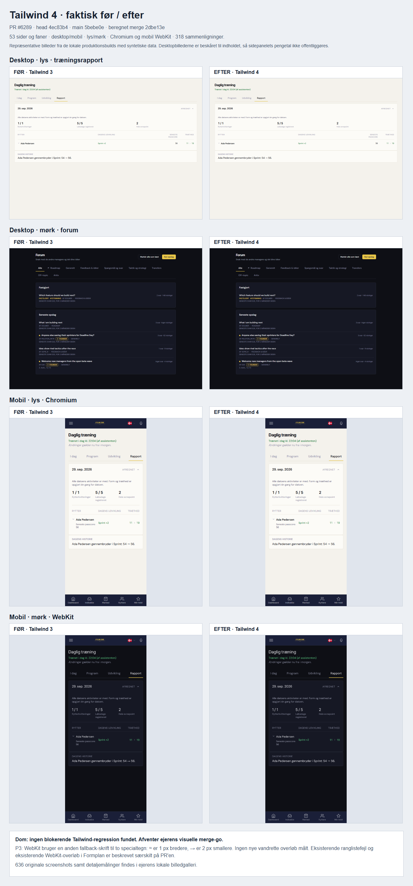

# Tailwind 4 — visuel aflevering 7/10

PR #6289 head `4ec83b42ed62d1178ccc4c7b29d2f8e36eb54183`, main-reference `5bebe0e2798603d39278afa8b30d909360800d18`, GitHub merge-ref `2dbe13ea5770051ba6d18661dc81aafd9017e927`.

Dom: ingen blokerende regressionsfund i Tailwind-migrationen. Afventer ejerens visuelle merge-go. Dette er reviewbevis, ikke en ændring til produktet.

53 sider/faner blev åbnet på begge produktionsbuilds i seks kombinationer: Chromium desktop 1440 og mobil 390 i lys/mørk samt WebKit mobil 390 i lys/mørk. 318 sammenligninger, 636 originale screenshots. Syntetiske API-data, fast fixture-dato og blokeret ekstern browsertrafik. Eget og uafhængigt read-only review; PR-headens 60 checks SUCCESS/SKIPPED, inklusive hele den eksisterende browserpakke. Ingen nye app-fejl eller vandrette side-overløb i de målte visninger.

- P3: WebKits font-fallback ændrer specialtegn. `≈`: 7 → 8 px; `→`: 15 → 13 px. En lokal DOM-probe med gammel fontstack gendanner præcis 7/15 px, mens linjehøjden er uændret. Berører Pro-noten og TrainingMoment. Der er ikke ændret kode som led i prøven.
- Eksisterende main-problem: styrkelinsens effect i StandingsPage starter `strengthLoading`, som er i dens egne dependencies. Cleanup kan dermed sætte `cancelled` før svaret lander. En kontrolleret fixture-prøve i begge builds returnerede 200 med to rækker, men beholdt `…`. Ikke indført af Tailwind. Det reducerer den sammenlignelige data-dækning for denne visning.
- Eksisterende WebKit-problem: Formplan har 6 px vandret side-overløb i begge builds. Ingen ny forskel.
- Dashboardets badges/oversættelser og indlæsningstilstande kan variere i billedprøven; de er ikke brugt som bevis for en CSS-regression. Den komplette samling er derfor ikke pixelidentisk.
- Handelsfanen og adminens fritekstfane: tidligere samme-head genreview målte 16 px ved 1280/390. Frisk CSS-analyse: alle 11 space-selektorer i v3-form og 0 @layer. Fremtidige group-/peer-space-varianter kræver fortsat #6290-vagten.

De brede billeder og måledata ligger i ejerens lokale galleri som regenererbar cache. Det delbare billede ovenfor viser repræsentative visninger og er beskåret, så sidepanelets pengetal ikke offentliggøres. Ingen prod-skrivning, spillertekst eller merge.
